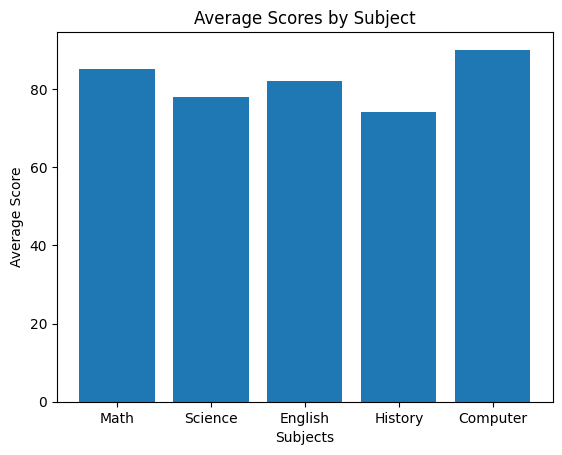
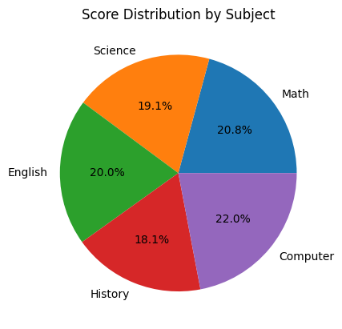
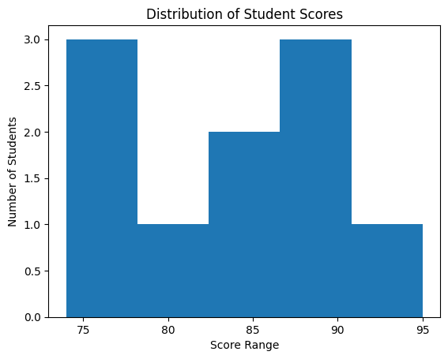

# Assignment 09 – Storytelling with Graphs

## Problem Statement 
Create visualizations using Python to understand patterns in data.

Graphs created:
- Bar Chart
- Pie Chart
- Histogram

Goal: Learn how graphs help in storytelling and identifying trends.

---

## Code
```python
import pandas as pd
import matplotlib.pyplot as plt

# Sample dataset (Student scores)
data = {
    "Subject": ["Math", "Science", "English", "History", "Computer"],
    "Average_Score": [85, 78, 82, 74, 90]
}

df = pd.DataFrame(data)

# ----------------------
# Bar Chart
# ----------------------
plt.figure()
plt.bar(df["Subject"], df["Average_Score"])
plt.title("Average Scores by Subject")
plt.xlabel("Subjects")
plt.ylabel("Average Score")
plt.savefig("bar_chart.png")
plt.show()

# ----------------------
# Pie Chart
# ----------------------
plt.figure()
plt.pie(
    df["Average_Score"],
    labels=df["Subject"],
    autopct='%1.1f%%'
)
plt.title("Score Distribution by Subject")
plt.savefig("pie_chart.png")
plt.show()

# ----------------------
# Histogram
# ----------------------
scores = [85, 78, 82, 74, 90, 88, 76, 95, 89, 84]

plt.figure()
plt.hist(scores, bins=5)
plt.title("Distribution of Student Scores")
plt.xlabel("Score Range")
plt.ylabel("Number of Students")
plt.savefig("histogram.png")
plt.show()
```

---

## Output Graphs

### Bar Chart


### Pie Chart


### Histogram


---

## Data Story (Insights)
- Computer subject has the highest average score.
- History subject has the lowest average score.
- Most subject scores fall between 75 and 90.
- Overall performance is balanced across subjects.
- Histogram shows majority of students scored in mid-to-high range.

---

## Concepts Used
- Data Visualization
- Matplotlib
- Bar Chart
- Pie Chart
- Histogram
- Python Programming
- Data Interpretation

---

## Learning Outcome
- Learned how to visualize data using graphs
- Understood how charts help identify trends
- Learned difference between bar, pie, and histogram charts
- Improved data storytelling skills
- Learned how visualization supports decision making

---

## Conclusion
Data visualization converts numerical data into meaningful insights. Graphs make it easier to understand patterns, comparisons, and distribution of data, which is important in Data Science and Machine Learning.
