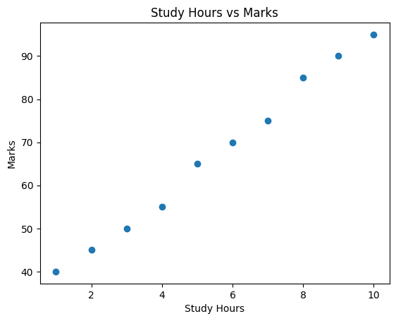

# Assignment 11 – Build Your First Dataset
Date: 03-03-2026

---

## Problem Statement
Create a simple dataset and understand how Machine Learning models use data.

Goal:
- Identify feature (input variable)
- Identify label (output variable)
- Understand relationship between variables

Dataset structure is the foundation of Machine Learning workflows.

---

## Dataset

| Study Hours | Marks |
|------------|------|
| 1 | 40 |
| 2 | 45 |
| 3 | 50 |
| 4 | 55 |
| 5 | 65 |
| 6 | 70 |
| 7 | 75 |
| 8 | 85 |
| 9 | 90 |
| 10 | 95 |

---

## Feature and Label

**Feature (Input Variable):**
- Study_Hours

**Label (Output Variable):**
- Marks

---

## Relationship Between Variables
There is a positive relationship between study hours and marks.

As study hours increase, marks also increase.  
This shows a linear pattern, which can be used in simple Machine Learning models such as Linear Regression.

---

## Code
```python
import pandas as pd
import matplotlib.pyplot as plt

# Creating dataset
data = {
    "Study_Hours": [1,2,3,4,5,6,7,8,9,10],
    "Marks": [40,45,50,55,65,70,75,85,90,95]
}

df = pd.DataFrame(data)

print("Dataset:")
print(df)

# Plot relationship
plt.scatter(df["Study_Hours"], df["Marks"])

plt.xlabel("Study Hours")
plt.ylabel("Marks")

plt.title("Study Hours vs Marks")

plt.savefig("A11_scatter.png")

plt.show()
```

---

## Output

### Dataset Output
```
   Study_Hours  Marks
0            1     40
1            2     45
2            3     50
3            4     55
4            5     65
5            6     70
6            7     75
7            8     85
8            9     90
9           10     95
```

---

## Scatter Plot Insight

Positive correlation between Study Hours and Marks.

As study time increases, performance improves.

### Graph


<!-- OR if using assets folder -->
<!--  -->

---

## Concepts Used
- Dataset Creation
- Features and Labels
- Data Visualization
- Scatter Plot
- Correlation
- Python (Pandas, Matplotlib)

---

## Key Learnings
- Structured datasets contain features (inputs) and labels (outputs)
- Visualization helps understand relationships between variables
- Scatter plots help identify trends in data
- Positive correlation means both variables increase together
- Forms foundation for regression models in Machine Learning

---

## Conclusion
Understanding dataset structure is the first step in Machine Learning. Identifying features and labels helps in building predictive models. Visualization helps detect patterns and relationships in data.
