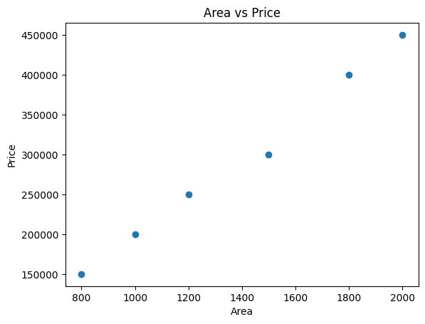

# Assignment 13 – House Price Predictor
Date: 09-03-2026

---

## Problem Statement
Train a Linear Regression model to predict house prices based on house features.

Inputs:
- Area
- Bedrooms
- Bathrooms

Output:
- Predicted house price

Regression models are used when the output variable is continuous (numerical value).

---

## Dataset

| Area (sq ft) | Bedrooms | Bathrooms | Price |
|-------------|----------|----------|-------|
| 800 | 2 | 1 | 150000 |
| 1000 | 2 | 1 | 200000 |
| 1200 | 3 | 2 | 250000 |
| 1500 | 3 | 2 | 300000 |
| 1800 | 4 | 3 | 400000 |
| 2000 | 4 | 3 | 450000 |

---

## Code
```python
import pandas as pd
import matplotlib.pyplot as plt
from sklearn.linear_model import LinearRegression

# Dataset
data = {
    "area":[800,1000,1200,1500,1800,2000],
    "bedrooms":[2,2,3,3,4,4],
    "bathrooms":[1,1,2,2,3,3],
    "price":[150000,200000,250000,300000,400000,450000]
}

df = pd.DataFrame(data)

# Features and label
X = df[["area","bedrooms","bathrooms"]]
y = df["price"]

# Train model
model = LinearRegression()
model.fit(X,y)

# Prediction for new house
prediction = model.predict([[2100,3,2]])

print("Predicted Price:", prediction[0])

# Visualization
plt.scatter(df["area"],df["price"])

plt.xlabel("Area")
plt.ylabel("Price")

plt.title("Area vs Price")

plt.savefig("A13_regression_plot.png")

plt.show()
```

---

## Output
```
Predicted Price:
470000 (approx)
```

---

## Graph Insight
- House price increases as area increases
- Positive relationship between area and price
- Larger houses tend to cost more

### Graph


<!-- OR -->
<!--  -->

---

## Concepts Used
- Linear Regression
- Supervised Learning
- Features and Labels
- Prediction Model
- Data Visualization
- Matplotlib
- Pandas
- Scikit-learn

---

## Key Learnings
- Linear regression predicts continuous values
- Multiple features influence prediction
- Model learns relationship between variables
- Visualization helps understand trend
- Regression widely used in real estate price prediction

---

## Conclusion
Linear Regression helps predict numerical values such as house prices. The model learns relationships between features (area, bedrooms, bathrooms) and price, enabling future predictions.
