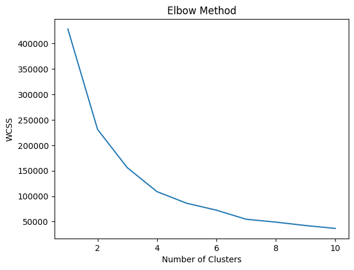
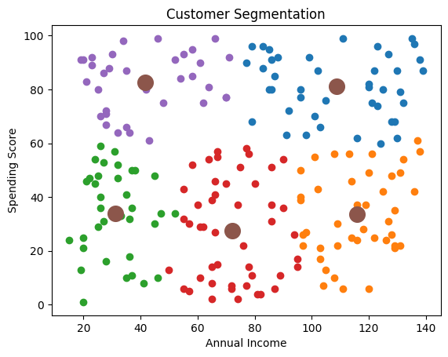

# Assignment 15 – Customer Segmentation using KMeans

## Problem Statement
Use K-Means clustering to group customers based on their income and spending behavior.

Clustering is an unsupervised learning technique used to identify patterns in unlabeled data.

Businesses use customer segmentation to improve marketing strategies and personalize services.

---

## Dataset
Sample customer dataset containing:

| Annual Income | Spending Score |
|--------------|---------------|
| numeric value | numeric value |

Features used:
- Annual Income
- Spending Score

---

## Code
```python
import pandas as pd
import matplotlib.pyplot as plt
from sklearn.cluster import KMeans
import numpy as np

# Create sample mall customer data
data = pd.DataFrame({
    "Annual Income (k$)": np.random.randint(15, 140, 200),
    "Spending Score (1-100)": np.random.randint(1, 100, 200)
})

# Select features
X = data[['Annual Income (k$)', 'Spending Score (1-100)']]

# Elbow method to find optimal clusters
wcss = []

for i in range(1,11):
    kmeans = KMeans(n_clusters=i, random_state=42)
    kmeans.fit(X)
    wcss.append(kmeans.inertia_)

plt.figure()

plt.plot(range(1,11), wcss)

plt.xlabel("Number of Clusters")
plt.ylabel("WCSS")
plt.title("Elbow Method")

plt.savefig("A15_elbow.png")

plt.show()

# Apply KMeans clustering
kmeans = KMeans(n_clusters=5, random_state=42)

y_kmeans = kmeans.fit_predict(X)

# Plot clusters
plt.figure()

plt.scatter(X.iloc[y_kmeans==0,0], X.iloc[y_kmeans==0,1])
plt.scatter(X.iloc[y_kmeans==1,0], X.iloc[y_kmeans==1,1])
plt.scatter(X.iloc[y_kmeans==2,0], X.iloc[y_kmeans==2,1])
plt.scatter(X.iloc[y_kmeans==3,0], X.iloc[y_kmeans==3,1])
plt.scatter(X.iloc[y_kmeans==4,0], X.iloc[y_kmeans==4,1])

# Plot centroids
plt.scatter(
    kmeans.cluster_centers_[:,0],
    kmeans.cluster_centers_[:,1],
    s=200
)

plt.xlabel("Annual Income")
plt.ylabel("Spending Score")

plt.title("Customer Segmentation")

plt.savefig("A15_clusters.png")

plt.show()
```

---

## Output Graphs

### Elbow Method Graph
Shows optimal number of clusters.



---

### Customer Segmentation Graph
Graph shows 5 clusters of customers based on income and spending patterns.



---

## Business Insights
Different customer groups identified:

1. High income – High spending  
   Premium customers

2. High income – Low spending  
   Careful buyers

3. Low income – High spending  
   Impulsive buyers

4. Low income – Low spending  
   Budget customers

5. Medium income – Medium spending  
   Average customers

Businesses can use this information for targeted marketing strategies.

---

## Concepts Used
- KMeans Clustering
- Unsupervised Learning
- Data Segmentation
- Pattern Recognition
- Matplotlib Visualization
- NumPy
- Pandas

---

## Key Learnings
- Clustering helps identify hidden patterns in data
- KMeans groups similar data points together
- Elbow method helps find optimal number of clusters
- Customer segmentation helps improve marketing decisions
- Unsupervised learning works without labeled output data

---

## Conclusion
KMeans clustering is widely used in marketing and business analytics to segment customers. Identifying customer groups helps companies create personalized strategies and improve customer satisfaction.
