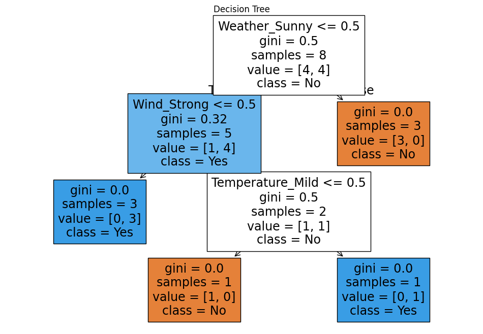

# Assignment 16 – Decision Tree Classification

## Problem Statement
Build a Decision Tree model to predict whether a person should play outside based on weather conditions.

Decision Trees are supervised learning algorithms used for classification and regression tasks.  
They split data into branches based on feature values to make predictions.

Decision Trees are easy to interpret and help visualize decision-making logic.

---

## Dataset

| Weather | Temperature | Humidity | Wind | PlayOutside |
|--------|------------|---------|------|-------------|
| Sunny | Hot | High | Weak | No |
| Sunny | Hot | High | Strong | No |
| Overcast | Hot | High | Weak | Yes |
| Rain | Mild | High | Weak | Yes |
| Rain | Cool | Normal | Weak | Yes |
| Rain | Cool | Normal | Strong | No |
| Overcast | Mild | Normal | Strong | Yes |
| Sunny | Cool | High | Weak | No |

Target variable:
PlayOutside (Yes / No)

---

## Code
```python
import pandas as pd
from sklearn.tree import DecisionTreeClassifier, plot_tree
import matplotlib.pyplot as plt

# Dataset
data = {
'Weather':['Sunny','Sunny','Overcast','Rain','Rain','Rain','Overcast','Sunny'],
'Temperature':['Hot','Hot','Hot','Mild','Cool','Cool','Mild','Cool'],
'Humidity':['High','High','High','High','Normal','Normal','Normal','High'],
'Wind':['Weak','Strong','Weak','Weak','Weak','Strong','Strong','Weak'],
'PlayOutside':['No','No','Yes','Yes','Yes','No','Yes','No']
}

df = pd.DataFrame(data)

# Convert categorical data into numerical values
X = pd.get_dummies(df.drop("PlayOutside",axis=1))

# Target variable
y = df["PlayOutside"]

# Train model
model = DecisionTreeClassifier()

model.fit(X,y)

# Visualize tree
plt.figure(figsize=(12,8))

plot_tree(
    model,
    feature_names=X.columns,
    class_names=model.classes_,
    filled=True
)

plt.title("Decision Tree")

plt.savefig("A16_decision_tree.png")

plt.show()
```

---

## Output

Decision Tree visualization showing rules used for prediction.

### Decision Tree Graph


---

## Example Decision Rules

Example logic learned by model:

- If Weather = Overcast → PlayOutside = Yes
- If Weather = Sunny and Humidity = High → PlayOutside = No
- If Weather = Rain and Wind = Strong → PlayOutside = No

---

## How Decision Tree Works
- Model splits dataset based on feature importance
- Each node represents a decision condition
- Branches represent possible outcomes
- Leaf nodes represent final predictions
- Model chooses best feature for splitting

---

## Concepts Used
- Decision Tree Algorithm
- Classification
- Feature Encoding (One-Hot Encoding)
- Model Visualization
- Supervised Learning
- Scikit-learn
- Pandas

---

## Key Learnings
- Decision Trees are easy to interpret
- Categorical variables must be encoded
- Tree structure helps understand decision logic
- Useful for classification problems
- Visual representation improves model understanding

---

## Conclusion
Decision Trees are powerful and interpretable Machine Learning models used for classification tasks. They help understand decision logic clearly and are widely used in predictive analytics.
