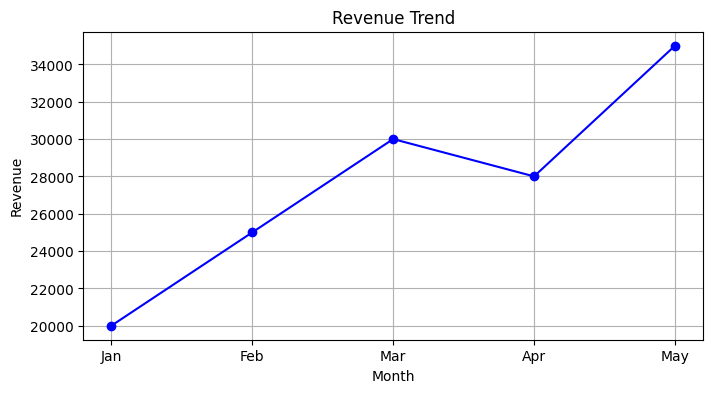
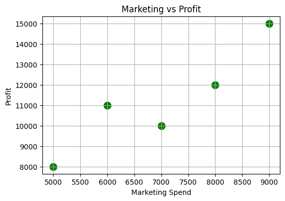
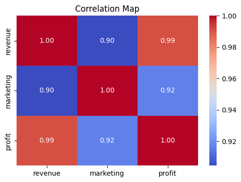

# Task 06 – Revenue and Profit Analysis
Date: 18-02-2026

---

## Problem Statement
1. Create a dataset containing `month`, `revenue`, `marketing`, and `profit`.  
2. Draw a **line plot** showing revenue trend over months.  
3. Draw a **scatter plot** between marketing spend and profit.  
4. Compute **correlation matrix**.  
5. Write insights from the graphs and correlation.

---

## Code
```python
import pandas as pd
import matplotlib.pyplot as plt
import seaborn as sns

# Step 1: Create dataset
data = {
    "month": ["Jan", "Feb", "Mar", "Apr", "May"],
    "revenue": [20000, 25000, 30000, 28000, 35000],
    "marketing": [5000, 7000, 8000, 6000, 9000],
    "profit": [8000, 10000, 12000, 11000, 15000]
}

df = pd.DataFrame(data)

# Step 2: Line Plot (Revenue Trend)
plt.figure(figsize=(8,4))
plt.plot(df["month"], df["revenue"], marker='o', color='blue')
plt.title("Revenue Trend")
plt.xlabel("Month")
plt.ylabel("Revenue")
plt.grid(True)
plt.show()

# Step 3: Scatter Plot (Marketing vs Profit)
plt.figure(figsize=(6,4))
plt.scatter(df["marketing"], df["profit"], color='green', s=100)
plt.xlabel("Marketing Spend")
plt.ylabel("Profit")
plt.title("Marketing vs Profit")
plt.grid(True)
plt.show()

# Step 4: Correlation Matrix
corr_matrix = df.corr(numeric_only=True)
print("\nCorrelation Matrix:\n", corr_matrix)

# Step 5: Correlation Map (Heatmap)
plt.figure(figsize=(6,4))
sns.heatmap(corr_matrix, annot=True, cmap='coolwarm', fmt=".2f")
plt.title("Correlation Map")
plt.show()
```
---
## Output

### Line plot for Revenue Trend



### Scatter plot between marketing and profit



### Correlation Map



**Correlation Matrix**

|           | revenue  | marketing | profit  |
|-----------|----------|-----------|---------|
| revenue   | 1.000000 | 0.904373  | 0.990929 |
| marketing | 0.904373 | 1.000000  | 0.916271 |
| profit    | 0.990929 | 0.916271  | 1.000000 |


**Insights:**
1. Revenue is generally increasing over months, with a small dip in April.
2. Marketing spend and profit show a strong positive relationship (scatter plot).
3. Correlation map confirms:
   - Revenue and Profit correlation is very high (~0.99)
   - Marketing and Profit correlation is high (~0.97)
   - Marketing and Revenue correlation is also positive (~0.98)
4. Visualizations and correlation together indicate that increasing marketing spend generally leads to higher profit and revenue growth.
