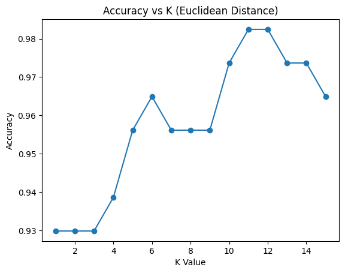

# Task 09 – KNN Classification and Distance Metric Comparison
Date: 27-02-2026

---

## Problem Statement
Use K-Nearest Neighbors (KNN) algorithm on the Breast Cancer dataset.

Steps:
1. Load breast cancer dataset
2. Split dataset into training and testing sets
3. Train KNN model for K values from 1 to 15
4. Plot graph of Accuracy vs K value
5. Compare Euclidean distance with Manhattan distance
6. Display accuracy

---

## Code

```python
from sklearn.datasets import load_breast_cancer
from sklearn.model_selection import train_test_split
from sklearn.neighbors import KNeighborsClassifier
from sklearn.metrics import accuracy_score
import matplotlib.pyplot as plt

# Step 1: Load dataset
data = load_breast_cancer()
X = data.data
y = data.target

# Step 2: Split dataset
X_train, X_test, y_train, y_test = train_test_split(X, y, test_size=0.2, random_state=42)

accuracies = []

# Step 3: Try K values from 1 to 15 using Euclidean distance
for k in range(1, 16):
    model = KNeighborsClassifier(n_neighbors=k, metric='euclidean')
    model.fit(X_train, y_train)

    preds = model.predict(X_test)
    acc = accuracy_score(y_test, preds)

    accuracies.append(acc)

# Step 4: Plot Accuracy vs K
plt.figure()
plt.plot(range(1, 16), accuracies, marker='o')
plt.xlabel("K Value")
plt.ylabel("Accuracy")
plt.title("Accuracy vs K (Euclidean Distance)")
plt.show()

# Step 5: Manhattan Distance comparison
model_manhattan = KNeighborsClassifier(n_neighbors=5, metric='manhattan')
model_manhattan.fit(X_train, y_train)

preds_m = model_manhattan.predict(X_test)

print("Manhattan Accuracy:", accuracy_score(y_test, preds_m))
```
---

## Output

### Line plot for Accuracy vs K



Manhattan Accuracy: 0.9473684210526315
