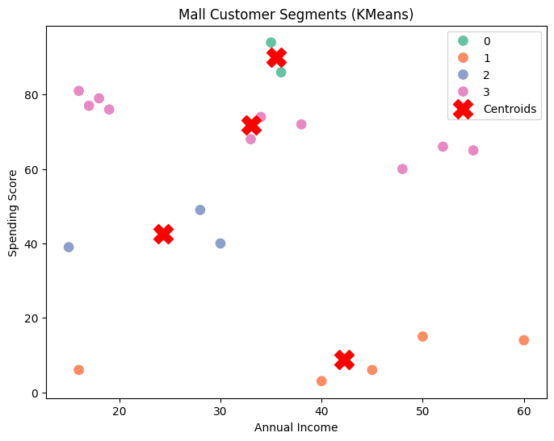

# Task 09 – Mall Customer Segmentation using KMeans
Date: 05-03-2026

---

## Problem Statement
1. Create a dataset of mall customers with the following features:  
   - `Age` (years)  
   - `Annual Income` (in USD or thousands)  
   - `Spending Score` (1-100)  
2. Apply **KMeans clustering** to segment customers into **4 or 5 clusters**.  
3. Plot the clusters and visualize customer segments.  
4. Display cluster centers.

---

## Code

```python
import pandas as pd
import matplotlib.pyplot as plt
from sklearn.cluster import KMeans
import seaborn as sns

# Step 1: Create sample dataset
data = {
    "Age": [19, 21, 20, 23, 31, 22, 35, 28, 30, 27, 40, 29, 36, 38, 24, 32, 33, 26, 37, 34],
    "Annual_Income": [15, 16, 16, 17, 30, 19, 45, 35, 40, 38, 60, 36, 50, 55, 18, 33, 34, 28, 52, 48],
    "Spending_Score": [39, 81, 6, 77, 40, 76, 6, 94, 3, 72, 14, 86, 15, 65, 79, 68, 74, 49, 66, 60]
}

df = pd.DataFrame(data)
print("Dataset:\n", df)

# Step 2: Apply KMeans
X = df[["Annual_Income", "Spending_Score"]]

# Choose 4 clusters (can change to 5)
kmeans = KMeans(n_clusters=4, random_state=42)
df["Cluster"] = kmeans.fit_predict(X)

# Step 3: Plot clusters
plt.figure(figsize=(8,6))
sns.scatterplot(x="Annual_Income", y="Spending_Score", hue="Cluster", data=df, palette="Set2", s=100)
plt.scatter(kmeans.cluster_centers_[:,0], kmeans.cluster_centers_[:,1], s=300, c="red", label="Centroids", marker="X")
plt.title("Mall Customer Segments (KMeans)")
plt.xlabel("Annual Income")
plt.ylabel("Spending Score")
plt.legend()
plt.show()

# Step 4: Display cluster centers
cluster_centers = pd.DataFrame(kmeans.cluster_centers_, columns=["Annual_Income", "Spending_Score"])
print("\nCluster Centers:\n", cluster_centers)

# Step 5: Display cluster assignment
print("\nCustomer Segments:\n", df)
```

---

## Output

**Dataset:**
| Index | Age | Annual_Income | Spending_Score |
|------:|----:|--------------:|---------------:|
| 0  | 19 | 15 | 39 |
| 1  | 21 | 16 | 81 |
| 2  | 20 | 16 | 6  |
| 3  | 23 | 17 | 77 |
| 4  | 31 | 30 | 40 |
| 5  | 22 | 19 | 76 |
| 6  | 35 | 45 | 6  |
| 7  | 28 | 35 | 94 |
| 8  | 30 | 40 | 3  |
| 9  | 27 | 38 | 72 |
| 10 | 40 | 60 | 14 |
| 11 | 29 | 36 | 86 |
| 12 | 36 | 50 | 15 |
| 13 | 38 | 55 | 65 |
| 14 | 24 | 18 | 79 |
| 15 | 32 | 33 | 68 |
| 16 | 33 | 34 | 74 |
| 17 | 26 | 28 | 49 |
| 18 | 37 | 52 | 66 |
| 19 | 34 | 48 | 60 |

---

**Cluster Centers:**

| Cluster | Annual_Income | Spending_Score |
|--------:|--------------:|---------------:|
| 0 | 35.50 | 90.00 |
| 1 | 42.20 | 8.80  |
| 2 | 24.33 | 42.67 |
| 3 | 33.00 | 71.80 |

---

**Customer Segments:**

| Index | Age | Annual_Income | Spending_Score | Cluster |
|------:|----:|--------------:|---------------:|--------:|
| 0  | 19 | 15 | 39 | 2 |
| 1  | 21 | 16 | 81 | 3 |
| 2  | 20 | 16 | 6  | 1 |
| 3  | 23 | 17 | 77 | 3 |
| 4  | 31 | 30 | 40 | 2 |
| 5  | 22 | 19 | 76 | 3 |
| 6  | 35 | 45 | 6  | 1 |
| 7  | 28 | 35 | 94 | 0 |
| 8  | 30 | 40 | 3  | 1 |
| 9  | 27 | 38 | 72 | 3 |
| 10 | 40 | 60 | 14 | 1 |
| 11 | 29 | 36 | 86 | 0 |
| 12 | 36 | 50 | 15 | 1 |
| 13 | 38 | 55 | 65 | 3 |
| 14 | 24 | 18 | 79 | 3 |
| 15 | 32 | 33 | 68 | 3 |
| 16 | 33 | 34 | 74 | 3 |
| 17 | 26 | 28 | 49 | 2 |
| 18 | 37 | 52 | 66 | 3 |
| 19 | 34 | 48 | 60 | 3 |

### KMeans Clustter of Mall Customer Segments


